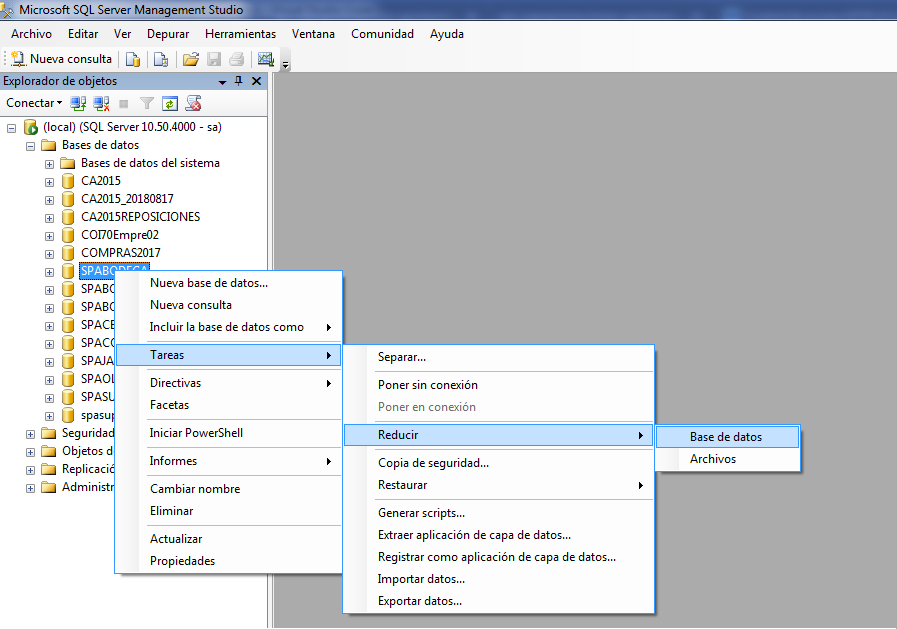
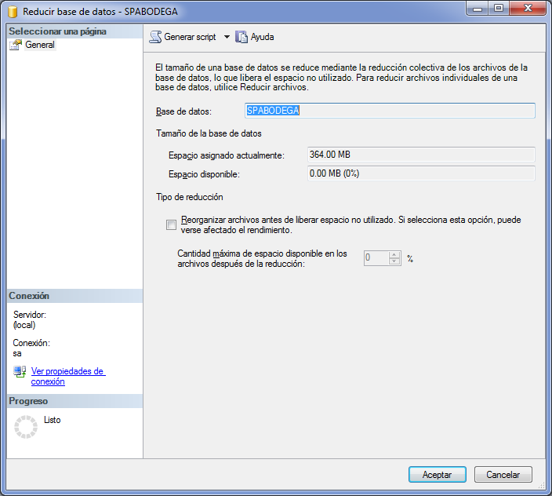

# Proceso de Cierre de Base de Datos en SPA

## ¿Por que se realiza el proceso?
Con el paso del tiempo las bases de datos van creciendo ya sea por que vamos aumentando la estructura de esta o por la gran cantidad de transaccionalidad que se le realizan dia a dia.

Este mantemimiento que se realiza cada 31 de agosto, lo que permite es mantener nuestras bases de datos agiles y con la sufieciente capacidad tanto de almacenamiento como de velocidad de respuesta, para asi el sistema WinCaja de buenos resultados como tambien nuestras aplicaciones creadas en el departamento de sistemas.

## Proceso de Cierre

1. Realizar respaldo con ayuda del SOS

    

2. Cambiaremos el nombre del respaldo por [ NombreRespaldo ] _ [ YYYYMM ].BAK.RAR
3. Entrar en WinCaja -> Procesos Especiales -> Cierres.
    
    - El cierre es por periodo 
    - Marcar todo excepto temas de facturación
    - Si ay cajas abilitadas en la tabla Cajas desabilitarlas
        ```SQL
        SELECT * FROM Cajas WHERE Habilitada = 1
        UPDATE Cajas SET Habilitada = 0
        ```
    - Volver a Cierres y finalizar el proceso 
4. Reducir el Log y la Base de Datos
    
    Para reducir el log basta con correr un pequeño script
    ```SQL
        USE [Nombre_Base_de_Datos] 
        CHECKPOINT
        CHECKPOINT

        -- SP_HELPFILE

        ALTER DATABASE [Nombre_Base_de_Datos]
        SET RECOVERY SIMPLE;
        GO

        DBCC SHRINKFILE (N'[Nombre_del_Log_de_Base_de_Datos]', 10)

        ALTER DATABASE [Nombre_Base_de_Datos]
        SET RECOVERY FULL;
        GO 
    ```
5. Montar el respaldo al principio creado y cambiar los nombres lógicos y físicos
   - El nombre de la Base de datos sera ahora [NombreOriginal]_[YYYYMM]
   - El Nombre de la direccion de la data sera [NombreOriginal]_[YYYYMM]_DATA.MDF
   - El Nombre de la direccion del log sera  [NombreOriginal]_[YYYYMM]_LOG.LDF
   - Los nombres logicos segiran la misma estructura 
        -  [NombreOriginal]_[YYYYMM]_DATA
        -  [NombreOriginal]_[YYYYMM]_LOG
  
6. Reducir el Log y la Base de Datos del respaldo
    1. Seleccionar la Base de datos
    2. Click derecho
    3. Tareas -> Reducir -> Base de Datos
    
    

